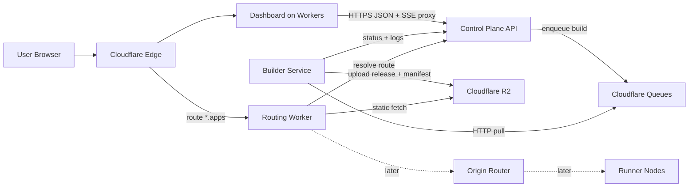

# Architecture (Hybrid Cloudflare + Self-Hosted, Static-First v1)

This document is the canonical system design for the deployment platform.

The platform direction is intentionally hybrid:

- Cloudflare owns the edge-facing experience.
- Self-hosted services own stateful orchestration and untrusted compute.
- The first sellable product is **static site deployment**, not full parity between static and container workloads.

## Goals

- Ship one coherent static deploy product before adding container orchestration complexity.
- Use Cloudflare where it is operationally strong:
  - dashboard hosting
  - edge routing
  - object storage
  - async job buffering
- Keep untrusted builds and long-running runtime concerns on self-hosted compute.
- Keep plane ownership explicit, with versioned contracts and at-least-once-safe workflows.

## Non-goals (initial product)

- Custom user domains.
- Preview environments.
- Multi-node runtime scheduling.
- Redis as a hard dependency.
- Worker-proxied container routing.
- Full container runtime parity with static deploys.

## Product Milestone Order

### Initial product: Static deploy

Users can:

- create a project
- trigger a static build
- watch build logs live
- publish an immutable release to R2
- load that release at `*.apps.<domain>`

### Next milestone: Container alpha

After the static path is reliable, add:

- runner nodes
- deploy jobs
- health-checked container rollout
- origin routing for container traffic

## Planes (Conceptual)

### 1) Edge Plane (Cloudflare)

Responsibilities:

- Serve the dashboard with SSR + streaming where useful.
- Proxy same-origin SSE streams for authenticated log viewing.
- Route wildcard app traffic for static releases.
- Act as the stable front door for later container traffic.

Cloudflare products used in the initial product:

- **Workers** for dashboard and wildcard app routing
- **R2** for immutable static artifacts and cold log archive
- **Queues** for build job dispatch only

### 2) Control Plane (Self-hosted)

Responsibilities:

- Source of truth for projects, builds, releases, and routes.
- AuthN/AuthZ for dashboard and service-to-service calls.
- Produce build jobs to Cloudflare Queues.
- Accept build status updates and build log ingestion.
- Expose SSE for build logs and status.
- Resolve hostname routing for the Worker.

Backed by:

- **Postgres** as canonical platform state from the start
- **Redis later if needed**, not as a day-one dependency

### 3) Build Plane (Self-hosted)

Responsibilities:

- Pull `build.requested.v1` jobs from Cloudflare Queues over HTTP.
- Clone source at a specific commit SHA.
- Build static assets inside isolated Docker environments.
- Upload immutable release artifacts and a manifest to R2.
- Stream logs and terminal status back to the control plane.

### 4) Runtime Plane (Later)

Responsibilities after the static milestone:

- Run containerized apps.
- Pull desired deploy state.
- Report health and runtime logs.

The runtime plane exists in the architecture, but it is not part of the first sellable product.

### 5) Routing Plane (Hybrid)

For the initial product:

- **Worker-first static routing** is the default.
- The Worker resolves `hostname -> active static release`.
- The Worker serves immutable assets from R2.

For the later container milestone:

- the Worker remains the front door
- container traffic is forwarded to a stable origin router
- the origin router selects the runner node

## High-Level Diagram

## End-to-End Flows

### Flow A: Static site deploy (initial product)

1. Dashboard or webhook triggers a deploy.
2. Control plane creates a build record and enqueues `build.requested.v1`.
3. Builder pulls the job, builds in Docker, and streams logs to the control plane.
4. Builder uploads immutable files plus `static_release_manifest.v1` to R2.
5. Control plane marks the release active for the hostname.
6. Routing Worker resolves the hostname and serves the release from R2.

### Flow B: Build log viewing

1. Builder posts ordered log chunks to the control plane.
2. Dashboard opens a same-origin SSE endpoint on Workers.
3. Worker route proxies the control-plane SSE stream.
4. Clients reconnect with `Last-Event-ID` to resume from the durable log stream.

### Flow C: Container alpha (later)

1. Control plane produces `deploy.requested.v1`.
2. Runner pulls the image and starts a container.
3. Runner reports health.
4. Worker forwards container traffic to the origin router.

## Why This Shape

- It keeps the first milestone small enough to ship.
- It uses R2 and Workers where they improve edge delivery and operator simplicity.
- It avoids putting Docker builds, runtime scheduling, or Redis fan-out in the critical path before the core user workflow is proven.
