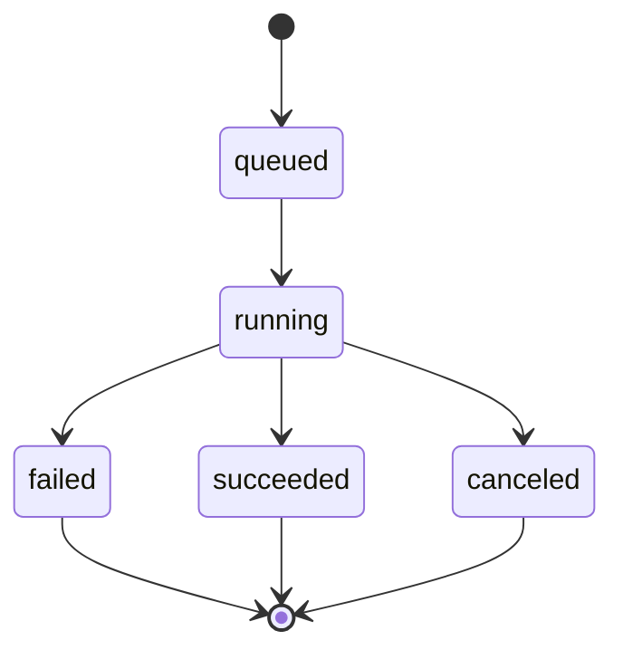

# Control Plane (API + State)

The control plane is the authoritative source of truth for the platform.

In the approved initial product, it is responsible for the **static deployment path** end to end.

## Responsibilities

- identity and access control
- project and release state
- build lifecycle state
- route ownership for wildcard hostnames
- build job production to Cloudflare Queues
- build log ingest and SSE streaming
- internal route resolution for the routing Worker

## Data Ownership

Canonical storage:

- **Postgres** for projects, builds, releases, routes, and audit-relevant state

Optional later storage:

- **Redis** for hot buffers, rate limits, or multi-instance fan-out if needed later

Artifacts are external:

- static release files and manifests in **R2**
- complete build logs in **R2** after completion

## Core Entities

- **User / Org**
- **Project**
- **Build**
- **Release**
- **Route**

Container-specific deployment entities can be layered in later without changing the static path contracts.

## Build State Machine (initial product)

Rules:

- every build has a stable `build_id`
- retries must be idempotent from the control plane perspective
- the control plane decides which build produced the active release

## Contracts (Dashboard / CLI → Control Plane)

- `POST /v1/projects`
- `GET /v1/projects/{project_id}`
- `POST /v1/projects/{project_id}/builds`
- `GET /v1/builds/{build_id}`
- `GET /v1/builds/{build_id}/logs/stream`
- `GET /v1/releases/{release_id}`

Rules:

- build-triggering endpoints accept `Idempotency-Key`
- the first product only needs to trigger **static** builds

## Contracts (Builder → Control Plane)

- `POST /v1/builds/{build_id}/status`
- `POST /v1/builds/{build_id}/logs`
- `POST /v1/builds/{build_id}/complete`

Recommended behavior:

- log chunks carry ordered identifiers
- terminal callbacks include artifact and manifest references
- service auth uses scoped service credentials, not long-lived shared secrets inside queue payloads

## Internal Contracts (Routing Worker → Control Plane)

### `GET /internal/routes/resolve`

The Worker calls:

- `GET /internal/routes/resolve?hostname=myapp.apps.example.com`

Response requirements:

- `route_kind`
- `release_id`
- `cache_ttl_seconds`
- `invalidation_version`
- R2 bucket/prefix and manifest pointer for static routes

See [platform-contracts.md](../platform-contracts.md) for the frozen response shape.

## Async Jobs

The control plane is the producer of:

- `build.requested.v1`

Do not make `deploy.requested.v1` part of the initial product critical path.

## Log Streaming (SSE)

SSE is the default log-tail mechanism.

Recommended event types:

- `log`
- `status`
- `heartbeat`

Requirements:

- include `id:` values
- honor `Last-Event-ID`
- allow resume from durable history after reconnect

The first product can serve SSE directly from a single control-plane instance. Redis fan-out is a later optimization, not a prerequisite.

## Security Boundaries

- builders are trusted services operating on untrusted source code
- dashboard auth is user-scoped
- Worker route resolution is service-scoped
- service-to-service calls should prefer short-lived tokens or another scoped credential model

## Later Extensions

These belong to later milestones:

- container deployment lifecycle
- preview environments
- runtime fleet scheduling
- custom domains
